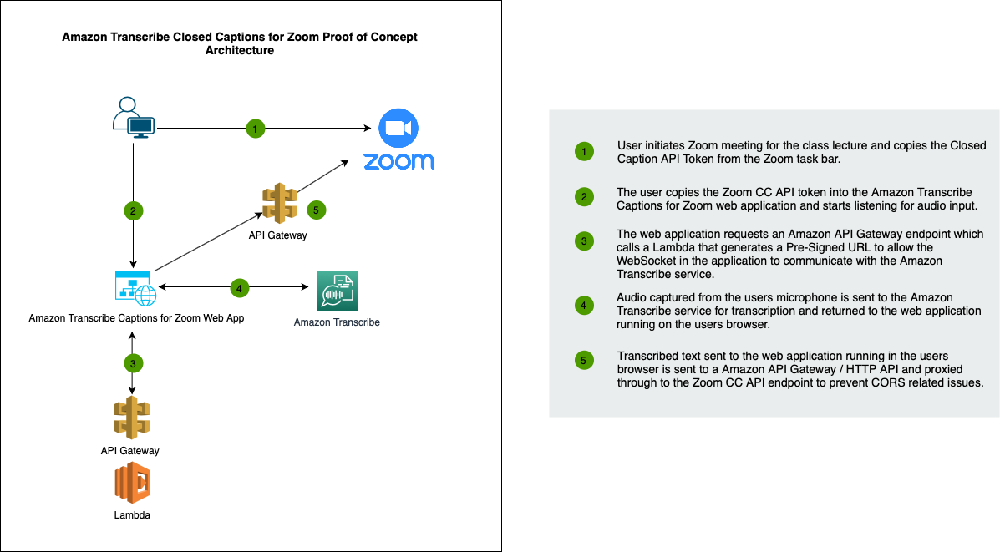
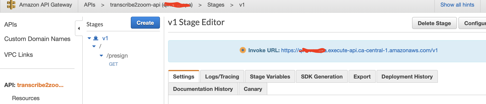

## Amazon Transcribe Real Time Close Captioning for Zoom Proof of Concept

This proof of concept demonstrates how you can use Amazon Transcribe as a third party close captioning service for Zoom. The concept was initiated to find a solution for instructors to provide real time close captions during lectures taking place in Zoom. The foundation of this PoC is based of the [AWS Samples - Amazon Transcribe Websocket Static](https://github.com/aws-samples/amazon-transcribe-websocket-static) project. 


## Zoom Requirements
1) The Account admin has enabled the ability for users to enable close captions.

2) Users to enable the closed captioning for your own use:
    * Sign in to the Zoom web portal.
    * In the navigation panel, click Settings.
    * Click the Meeting tab.
    * Verify that Closed Caption is enabled.
    * If the setting is disabled, click the toggle to enable it. 
    * If a verification dialog displays, click Turn On to verify the change.
    * Enable Save Captions to allow participants to save transcripts at the end of Zoom session 

## Architecture




## Building and Deploying 

### Step 1.
This application requires an API Gateway endpoints and a Lambda to create a Pre-Signed WebSocket URL 

1.1 create a s3 deployment bucket
```
aws s3api create-bucket --bucket {YOUR_BUCKET_NAME} --create-bucket-configuration LocationConstraint={YOUR REGION} --region {YOUR REGION} --profile  {YOUR PROFILE}

```

```
aws --profile  {YOUR_PROFILE}  cloudformation package --template-file ./transcribe2zoom_cfn.yaml  --s3-bucket {YOUR_BUCKET_NAME}  --output-template-file output.yml

```

1.2 Deploy the template package.

The paramater values for the region you want the transcriptions to occur in:

REGION

```
aws cloudformation deploy --capabilities CAPABILITY_NAMED_IAM --profile  {YOUR_PROFILE} --template ./output.yml --stack-name transcribe2zoom --parameter-overrides REGION={REGION_TO_RUN_TRANSCRIBE_IN}
```

## Step 2. Configure the App.

2.1 Copy the `config.json.tpl` to `config.json`

```
 cp config.json.tpl config.json
```

2.2 After deploying the CloudFormation Stack get the API Gateway Invoke URL that is required to communicate with the backend Lambda and create a Pre-Signed URL.

Goto the AWS Console -> API Gateway -> transcribe2zoom-api -> Stages ->



2.3 Copy the API Gateway Invoke URL to the application config file `config/config.json`:
```
    'api_gateway_endpoint': 'https://YOUR-API-URL.execute-api.ca-central-1.amazonaws.com/v1/presign',

```

2.4 The application requires a HTTP CORS proxy to communicate with the Zoom CC API endpoint. 

Goto the AWS Console -> API Gateway -> http-cors-proxy-for-zoom-cc-api


2.5 Copy the API Gateway Invoke URL to the application config file `config/config.json`:

```
'http_cors_proxy_api': 'https://YOUR-HTTP-PROXY-API.execute-api.ca-central-1.amazonaws.com',

```

## Step 3. Launch the Amplify App via Git:

Amplify  offers Git-based deployments with features like CI/CD and branch previews.

Follow the instructions outlined in follwing document to implement a Git based deploy: https://docs.aws.amazon.com/amplify/latest/userguide/getting-started.html 

## Alternative how to test / run the front end client locally 

Even though this is a static site there is a build step required. Some of the modules used were originally made for server-side code and do not work natively in the browser.

We use [browserify](https://github.com/browserify/browserify) to enable browser support for the JavaScript modules we `require()`.

1. Clone the repo
2. run `npm install`
3. run `npm run-script build` to generate `dist/main.js`.

Once you've bundled the JavaScript, all you need is a webserver. For example, from your project directory: 

```
npm install --global local-web-server
ws --log.format dev
```

## Use the Application. 

After meeting the Zoom requirements. 

Launch a new Zoom meeting, on the meeting room task bar click on the Close Caption icon and "Copy the API token" this will be used in the transcription application.


Next goto the Real-time Audio Transcription Close Captioning for Zoom URL

Paste the token and select language:


Hit the Start button when you are ready to start recording audio to be transcribed. This will prompt a browser response to grant access to your microphone click 'Allow'.


### Further Recommendations

This is a proof of concept it would be highly recommended to add an authentication layer if deploying on campus.  

### Credits

This project is largely based on code written for the Amazon Transcribe Websocket Static project https://github.com/aws-samples/amazon-transcribe-websocket-static  and modified for use with Zoom by the team at the UBC Cloud Innovation Centre. 

## License

This library is licensed under the Apache 2.0 License. 
